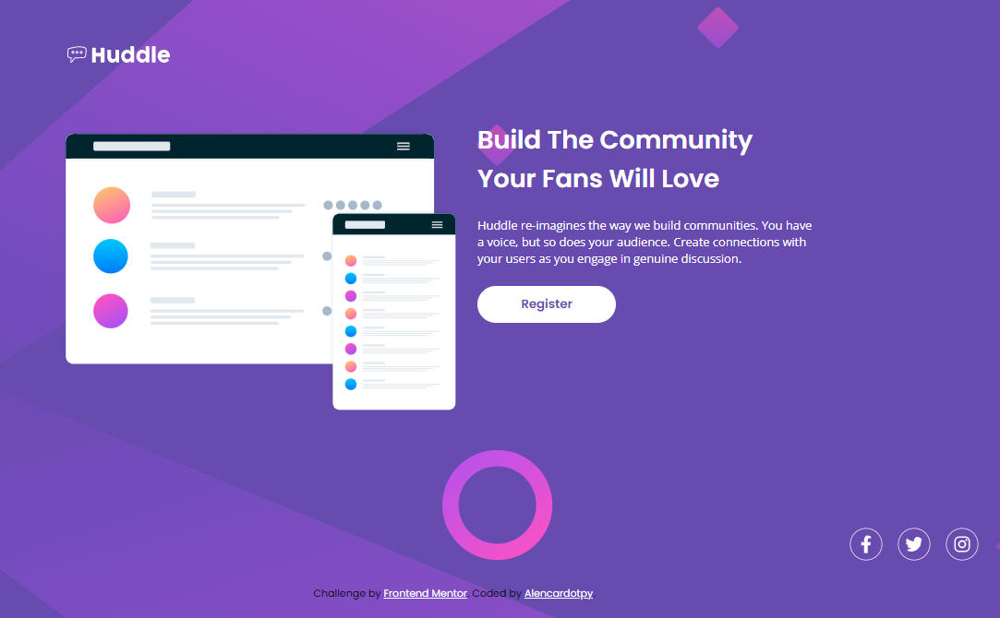
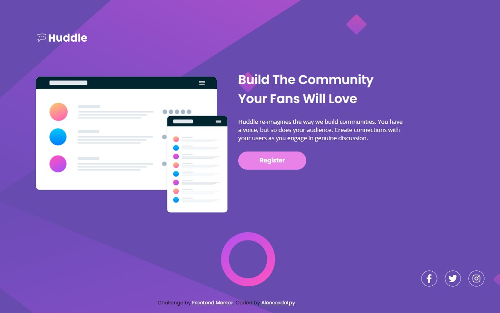
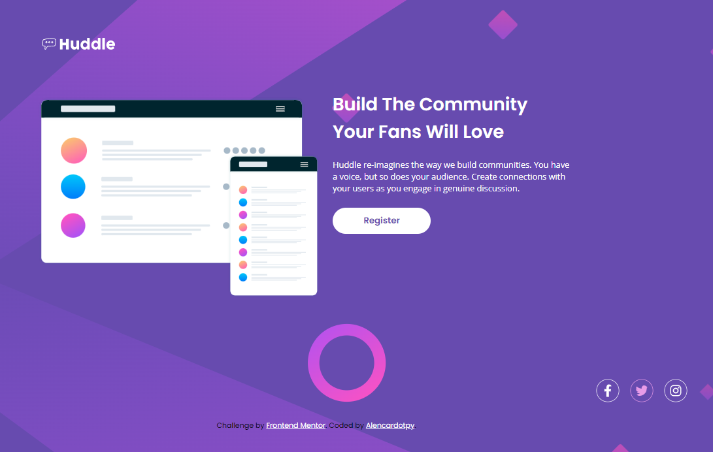

# Frontend Mentor - Huddle landing page with single introductory section solution

This is a solution to the [Huddle landing page with single introductory section challenge on Frontend Mentor](https://www.frontendmentor.io/challenges/huddle-landing-page-with-a-single-introductory-section-B_2Wvxgi0). Frontend Mentor challenges help you improve your coding skills by building realistic projects.

## Table of contents

- [Overview](#overview)
  - [The challenge](#the-challenge)
  - [Screenshot](#screenshot)
  - [Links](#links)
- [My process](#my-process)
  - [Built with](#built-with)
- [Author](#author)

## Overview

### The challenge

Users should be able to:

- View the optimal layout for the page depending on their device's screen size
- See hover states for all interactive elements on the page

### Screenshot

- Mobile View
  
  
  

- Desktop View
  
  
  

### Links

- Solution URL: [GitHub repo](https://github.com/alencardotpy/huddle-landing-page-with-single-introductory-section)
- Live Site URL: [GitHub Pages](https://alencardotpy.github.io/huddle-landing-page-with-single-introductory-section)

## My process

### Built with

- Semantic HTML5 markup
- CSS custom properties
- Flexbox
- CSS Grid
- Mobile-first workflow

## Author

- GitHub - [AlencarDotPy](https://github.com/alencardotpy)
- Frontend Mentor - [@alencardotpy](https://www.frontendmentor.io/profile/alencardotpy)
- Twitter - [@alencardotpy](https://www.twitter.com/alencardotpy)
